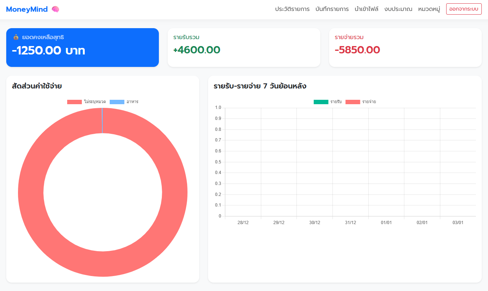
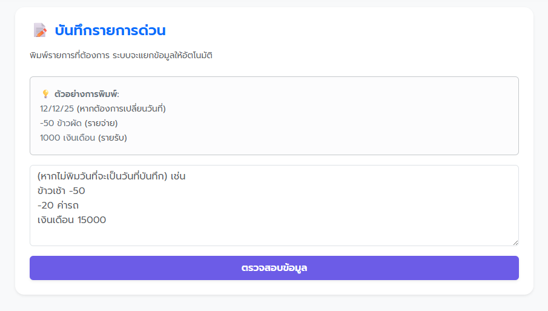
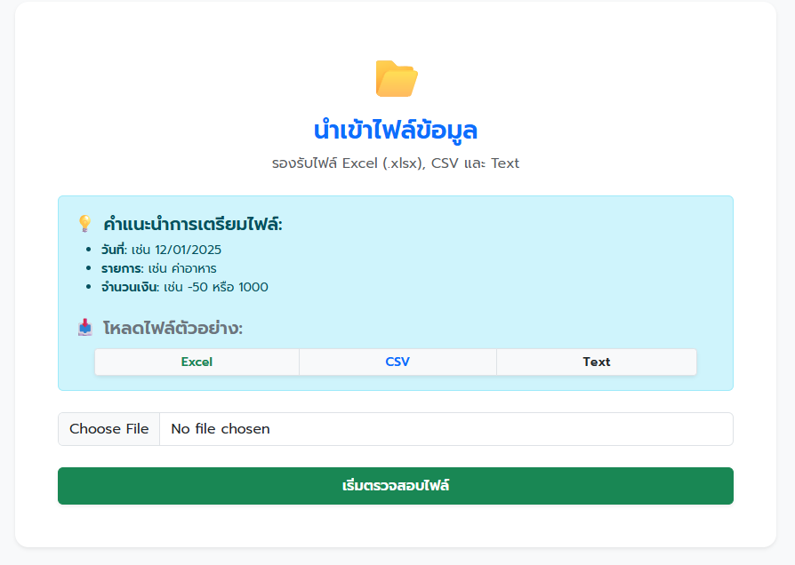
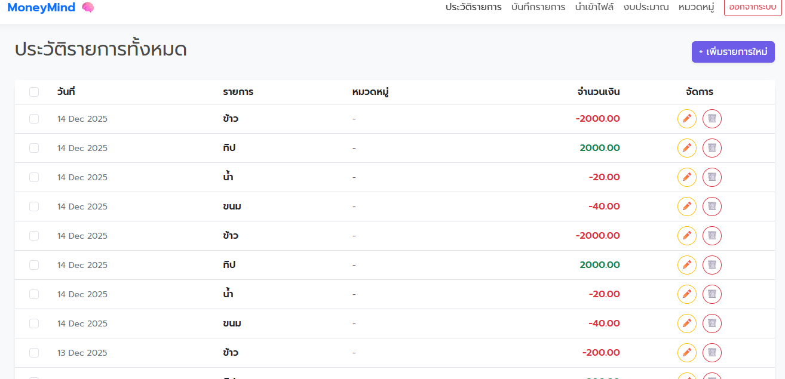
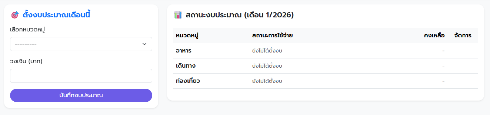

# MoneyMind 🧠 - Personal Finance Manager

**MoneyMind** คือเว็บแอปพลิเคชันสำหรับจัดการรายรับ-รายจ่ายส่วนบุคคลที่เน้นความ "ง่าย" และ "รวดเร็ว" พัฒนาด้วย **Django Framework** มาพร้อมกับระบบ **Smart Input** ที่ช่วยให้คุณจดบันทึกได้เหมือนการพิมพ์แชท และระบบ **Data Import** ที่รองรับไฟล์จากภายนอกได้อย่างสมบูรณ์แบบ



## ✨ ฟีเจอร์หลัก (Key Features)

### 1. 📝 Smart Input (บันทึกรายการด่วน)
ไม่ต้องกรอกฟอร์มทีละช่อง! เพียงพิมพ์รายการลงไป ระบบจะแยก วันที่, รายการ, และจำนวนเงิน ให้อัตโนมัติ
- **รองรับ Natural Language:** เช่น `ข้าวผัด -50`, `เงินเดือน 20000`, `25/12/25 ค่ากาแฟ -120`
- **Preview Before Save:** มีระบบตรวจสอบความถูกต้อง แก้ไข หรือลบรายการก่อนบันทึกจริง

### 2. 📂 Advanced Data Import (นำเข้าข้อมูล)
รองรับการย้ายข้อมูลจากที่อื่นมาลงในระบบได้ง่ายๆ
- **รองรับหลายไฟล์:** Excel (`.xlsx`), CSV (`.csv`) และ Text File (`.txt`)
- **Text File Logic:** รองรับรูปแบบการจดบันทึกแบบบรรทัดต่อบรรทัด (วันที่บรรทัดนึง รายการบรรทัดนึง)
- **Data Preview:** ตรวจสอบข้อมูลก่อนนำเข้า แก้ไขรายการที่ผิดพลาดได้ทันทีผ่าน Modal

### 3. 📊 Dashboard & Visualization
เห็นภาพรวมสุขภาพทางการเงินได้ทันที
- สรุปยอดรายรับ, รายจ่าย และเงินคงเหลือ
- กราฟวงกลม (Donut Chart) แสดงสัดส่วนค่าใช้จ่ายตามหมวดหมู่
- กราฟแท่ง (Bar Chart) เปรียบเทียบรายรับ-รายจ่ายย้อนหลัง 7 วัน

### 4. 💰 Budget Management (ระบบงบประมาณ)
คุมกำเนิดค่าใช้จ่ายด้วยการตั้งงบประมาณรายหมวดหมู่
- แถบสถานะแสดงยอดที่ใช้ไป vs ยอดคงเหลือ
- แจ้งเตือนด้วยสี (เขียว/เหลือง/แดง) เมื่อใกล้เกินงบ

### 5. 🛠️ Transaction Management (จัดการรายการ)
- **CRUD:** แก้ไขและลบรายการได้ง่ายๆ ผ่าน Pop-up Modal
- **Bulk Delete:** ลบรายการหลายรายการพร้อมกันได้ในคลิกเดียว (Checkbox Selection)

---

## 📸 Screenshots

| Smart Input & Preview | Import Data |
| --------------------- | ----------- |
|  |  |

| Transaction History | Budgeting |
| ------------------- | --------- |
|  |  |

---

## 🛠️ เทคโนโลยีที่ใช้ (Tech Stack)

- **Backend:** Python, Django
- **Database:** SQLite (Default)
- **Frontend:** HTML5, CSS3, Bootstrap 5 (Responsive Design)
- **Data Processing:** Pandas (สำหรับการจัดการไฟล์ Excel/CSV)
- **JavaScript:** Vanilla JS (สำหรับจัดการ Modal และ AJAX Interaction)

---

## 🚀 วิธีติดตั้งและใช้งาน (Installation)

1. **Clone โปรเจกต์**
   ```bash
   git clone [https://github.com/ManYaiMark/moneymind.git](https://github.com/ManYaiMark/moneymind.git)
   cd moneymind

2. **สร้าง Virtual Environment**
    ```bash
    # Windows
    python -m venv venv
    venv\Scripts\activate

    # Mac/Linux
    python3 -m venv venv
    source venv/bin/activate

3. **ติดตั้ง Libraries ที่จำเป็น**
    ```bash
    pip install -r requirements.txt

4. **Migrate Database**
    ```bash
    python manage.py migrate

5. **รัน Server**
    ```bash
    python manage.py runserver

6. **ใช้งาน เปิด Browser ไปที่ http://127.0.0.1:8000/**